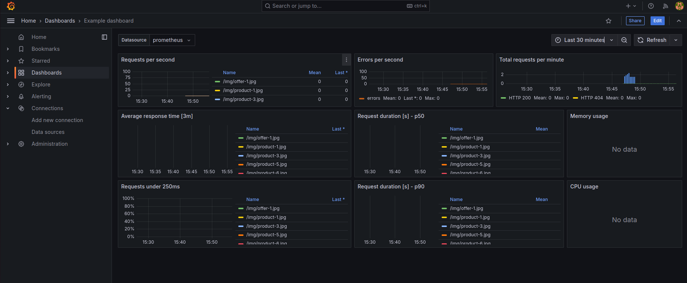

# Fake Shop

## Variável de Ambiente
DB_HOST	=> Host do banco de dados PostgreSQL.

DB_USER => Nome do usuário do banco de dados PostgreSQL.

DB_PASSWORD	=> Senha do usuário do banco de dados PostgreSQL.

DB_NAME	=>	Nome do banco de dados PostgreSQL.

DB_PORT	=>	Porta de conexão com o banco de dados PostgreSQL.

### 🛠️ Construido com
* [Repositório Original](https://github.com/KubeDev/fake-shop) - Repositório original do projeto - Fabricio Veronez.
* [Repositório Fork](https://github.com/jorginho-dev/fake-shop) - Repositório do projeto  - Jorge Guimarães
* [Dockerhub](https://hub.docker.com/repository/docker/jorgesilvaguimaraes/fake-shop) - Imagem docker no Dockerhub

### 🛠️ Resultado Final na AWS

### 🛠️ Dashboard

